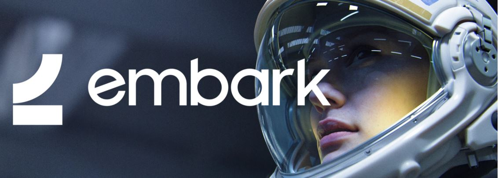

## *The future belongs to the <u>curious</u>*

We try to pair the innovation-mindset of an underdog with AAA ambition. 
Every breakthrough that happens here is driven by asking ourselves **‘what if’**

  <a href="https://www.embark-studios.com">Our Projects</a>
  ·
  <a href="https://github.com/EmbarkStudios/.github/blob/master/CODE_OF_CONDUCT.md">Our Code of Conduct</a>
  ·
  <a href="https://careers.embark-studios.com/">Join Us</a>

----

#### Contribute to Embark Studios

Embark Studios is a game development studio based in Sweden. We believe in open source and are always looking for new contributions. Any and all contributions are valued and welcome, from small documentation fixes to large new feature additions and collaborations.

Look through our open source repos (in particular the ones we have pinned) and look for any issues that excite you. If you'd like any guidance on an issue or where to start you can always reach out by opening a discussion in the repo.

#### Keep this community safe

Embark Studios follows the [Contributor Covenant Code of Conduct](../CODE_OF_CONDUCT.md). Please abide by these Codes of Conduct when interacting with all repositories under the Embark Studios organisations and when interacting with people on gitHub or other channels like Discord.

#### Report security incidents

Please be mindful that security-related issues should be reported through our [Security Policy](../SECURITY.md) as security-related issues and vulnerabilities can be exploited and we request confidentiality whenever possible.
